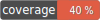

# Aegisora Boolean Rule

Boolean Rule provides a simple and strict **boolean value equality validation** for the Aegisora ecosystem.

The package is built on top of `aegisora/rule-contract` and follows its validation architecture, ensuring predictable and safe behavior.

---

## ✨ Features

- 🔹 Minimalistic implementation with no extra dependencies
- 🔹 Strict type validation (`bool` only)
- 🔹 Comparison using `===`
- 🔹 Supports validation for both `true` and `false`
- 🔹 Fully compatible with Aegisora validation pipeline
- 🔹 Clear `Context → Result` flow
- 🔹 No raw booleans — only structured `Result`
- 🔹 Safe execution via base `Rule` abstraction
- 🔹 Convenient factory methods (`createTruthy`, `createFalsy`)
- 🔹 Built-in input validation

---